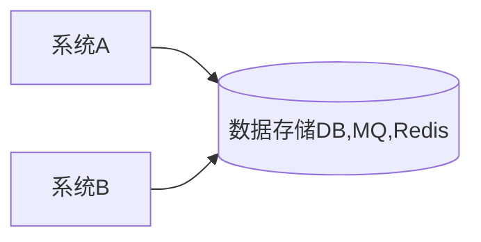
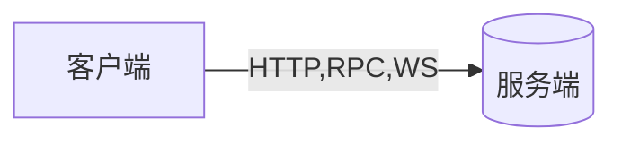
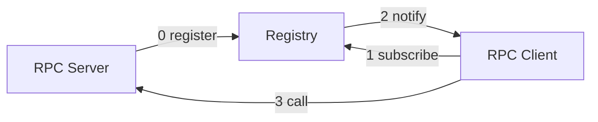

# 1. RPC概念

* **RPC** - Remote Procedure Call ，即远程服务调用

是分布式系统常见的一种通信方式，从跨进程到跨物理机已有几十年的历史。

在RPC中，可像调用本地方法一样调用远程方法

> **跨进程交互方式**： RESTful, WebService, HTTP, 基于DB做数据交换， 基于MQ做数据交换，RPC


* 依赖中间件做数据交互

数据可以被积压



* 直接交互




## 1.1 RPC和HTTP

- 纯裸 TCP 是能收发数据，但它是个无边界的数据流，上层需要定义消息格式用于定义 **消息边界** 。于是就有了各种协议，HTTP 和各类 RPC 协议就是在 TCP 之上定义的应用层协议。
- **RPC 本质上不算是协议，而是一种调用方式**，而像 gRPC 和 Thrift 这样的具体实现，才是协议，它们是实现了 RPC 调用的协议。目的是希望程序员能像调用本地方法那样去调用远端的服务方法。同时 RPC 有很多种实现方式，**不一定非得基于 TCP 协议**。
- 从发展历史来说，**HTTP 主要用于 B/S 架构，而 RPC 更多用于 C/S 架构。但现在其实已经没分那么清了，B/S 和 C/S 在慢慢融合。** 很多软件同时支持多端，所以对外一般用 HTTP 协议，而内部集群的微服务之间则采用 RPC 协议进行通讯。
- RPC 其实比 HTTP 出现的要早，且比目前主流的 HTTP1.1 性能要更好，所以大部分公司内部都还在使用 RPC。
- **HTTP2.0** 在 **HTTP1.1** 的基础上做了优化，性能可能比很多 RPC 协议都要好，但由于是这几年才出来的，所以也不太可能取代掉 RPC。

## 1.2 RPC原理

| Server   | Provider, 暴露服务，服务提供方   |
| -------- | -------------------------------- |
| Client   | Consumer，服务消费，调用远程服务 |
| Registry | 服务注册与发现                   |




1. 服务消费端（client）以本地调用的方式调用远程服务；
2. 客户端 Stub（client stub） 接收到调用后负责将方法、参数等组装成能够进行网络传输的消息体（序列化）：`RpcRequest`；
3. 客户端 Stub（client stub） 找到远程服务的地址，并将消息发送到服务提供端；
4. 服务端 Stub（桩）收到消息将消息反序列化为Java对象: `RpcRequest`；
5. 服务端 Stub（桩）根据`RpcRequest`中的类、方法、方法参数等信息调用本地的方法；
6. 服务端 Stub（桩）得到方法执行结果并将组装成能够进行网络传输的消息体：`RpcResponse`（序列化）发送至消费方；
7. 客户端 Stub（client stub）接收到消息并将消息反序列化为Java对象:`RpcResponse` ，这样也就得到了最终结果。over!

## 1.3 技术栈

* 基础知识 Java，Maven，反射
* Java的动态代理 （生成client存根实际调用对象）
* 序列化 (Java 对象与二进制数据互转) 使用**fastjson**
* 网络通信（传输序列化后的数据）jetty, URLConnection

# 2. 代码实现

## 2.1 流程

1. 创建工程，制定协议、通用工具方法
2. 实现序列化模块
3. 实现网络模块
4. 实现Server模块
5. 实现Client模块
6. GK-RPC使用案例

## 2.2 类图


## 2.3 rpc-proto模块

分别定义网络端点类 peer，RPC请求类 Request，RPC响应类Response， 服务类ServiceDescriptor

```java
public class Peer {
    private String host;
    private int port;
}
public class Request {
    private ServiceDescriptor service;
    private Object[] parameters;
}
public class Response {
    private int code = 0;   // 0-成功，非0 - 失败
    private String message = "ok";     // 具体原因
    private Object data;
}
public class ServiceDescriptor {
    private String clazz;
    private String method;
    private String returnType;
    private String[] parameterTypes;
}
```

## 2.4 rpc-common模块

添加反射工具类

```java
public class ReflectionUtils {
    /**
     * 根据class 创建对象
     * @param clazz
     * @param <T>
     * @return
     */
    public static <T> T newInstance(Class<T> clazz){
        try {
            return clazz.newInstance();
        } catch (Exception e) {
            throw new IllegalStateException();
        }
    }

    /**
     * 获取某个class类的公有方法
     * @param clazz
     * @return
     */
    public static Method[] getPublicMethods(Class clazz){
        Method[] methods = clazz.getDeclaredMethods();
        List<Method> pMethods = new ArrayList<>();
        for(Method m : methods){
            if(Modifier.isPublic(m.getModifiers())){
                pMethods.add(m);
            }
        }
        return pMethods.toArray(new Method[0]);
    }

    /**
     * 调用指定对象的指定方法
     * @param obj 被调用方法对象
     * @param method 被调用方法
     * @param args 方法的参数
     * @return
     */
    public static Object invoke(Object obj, Method method, Object ...args){
        try {
            return method.invoke(obj,args);
        } catch (IllegalAccessException e) {
            e.printStackTrace();
            return null;
        } catch (InvocationTargetException e) {
            e.printStackTrace();
            return null;
        }
    }
}
```

## 2.5 rpc-codec模块

定义序列化和反序列化接口Encoder，Decoder，并使用fastjson实现功能

```java
public class JSONEncoder implements Encoder {
    @Override
    public byte[] encode(Object obj) {
        return JSON.toJSONBytes(obj);
    }
}
public class JSONDecoder implements Decoder {
    @Override
    public <T> T decode(byte[] bytes, Class<T> clazz) {
        return JSON.parseObject(bytes, clazz);
    }
}
```

## 2.6 rpc-transport模块

该模块为网络模块，后续的client，server模块通过transport交流

| TransportClient           | TransportServer         |
| ------------------------- | ----------------------- |
| 1. 创建数据               | 1. 启动，监听           |
| 2. 发送数据，并且等待响应 | 2. 接收请求，处理，响应 |
| 3. 关闭连接               | 3. 关闭                 |

```java
public class HTTPTransportClient implements TransportClient {
    private String url;
    private HttpURLConnection connection;

    @Override
    public void connect(Peer peer) {
        this.url = "http://" + peer.getHost() + ":" + peer.getPort();
    }

    @Override
    public InputStream write(InputStream data) {
        try {
            connection = (HttpURLConnection) new URL(url).openConnection();
            connection.setDoOutput(true);
            connection.setDoInput(true);
            connection.setUseCaches(false);
            connection.setRequestMethod("POST");

            connection.connect();   // 建立连接
            IOUtils.copy(data, connection.getOutputStream());   // 将要写入的data 直接复制到当前连接的OutputStream中

            int responseCode = connection.getResponseCode();
            if(responseCode == HttpURLConnection.HTTP_OK){
                return connection.getInputStream();
            }
            else{
                return connection.getErrorStream();
            }
        } catch (IOException e) {
            throw new IllegalStateException(e);
        }
    }

    @Override
    public void close() {
        connection.disconnect();
    }
}
```

* jetty server的基础架构

> **Connector**: 接收HTTP Connections
>
> **Handler**: 处理来自Connector接收到的 requests，还可以处理 responses
>
> **Server**：将Connector和handler 组织在一起， 可以是用server启动jetty服务, 可以添加Connector和Handler， Server 在启动时将会启动其持有的Connector。 Handler 可以读取request 信息，并可以通过response向客户端发送响应信息。

```java
@Slf4j
public class HTTPTransportServer implements TransportServer {
    private RequestHandler handler;
    private Server server;

    @Override
    public void init(int port, RequestHandler handler) {
        this.handler = handler;
        this.server = new Server(port); // 创建server

        // servlet接受请求
        ServletContextHandler ctx = new ServletContextHandler();    // 创建一个contextHandler
        server.setHandler(ctx);

        ServletHolder holder = new ServletHolder(new RequestServlet());
        ctx.addServlet(holder,"/*");
    }

    @Override
    public void start() {
        try {
            server.start();
            server.join();
        } catch (Exception e) {
            log.error(e.getMessage(),e);
        }
    }

    @Override
    public void stop() {
        try {
            server.stop();
        } catch (Exception e) {
            log.error(e.getMessage(),e);
        }
    }

    class RequestServlet extends HttpServlet{
        @Override
        protected void doPost(HttpServletRequest req, HttpServletResponse resp) throws IOException{
            log.info("client connected");

            InputStream is = req.getInputStream();
            OutputStream os = resp.getOutputStream();

            if(handler != null){
                handler.onRequest(is,os);
            }
            os.flush();	// 刷新输出流并且将输出字节写出
        }
    }
}
```

## 2.7 rpc-server模块

server配置

```java
public class RpcServerConfig {
    // <? extends TransportServer> 上界通配符，指所有TransportServer类及其派生子类
    // JDK中，普通的Class.newInstance()方法的定义返回Object，要将该返回类型强制转换为另一种类型;
    // 但是使用泛型的Class<T>，Class.newInstance()方法具有一个特定的返回类型;
    private Class<? extends TransportServer> transportClass = HTTPTransportServer.class;
    private Class<? extends Encoder> encoderClass = JSONEncoder.class;
    private Class<? extends Decoder> decoderClass = JSONDecoder.class;
    private int port = 3000;
}
```

RpcServer类

```java
@Slf4j
public class RpcServer {
    private RpcServerConfig config;
    private TransportServer net;
    private Encoder encoder;
    private Decoder decoder;
    private ServiceManager serviceManager;  // 服务管理 (注册，寻找)
    private ServiceInvoker serviceInvoker;  // 服务调用

    // 处理网络要求的 handler
    private RequestHandler handler = (receive, os) -> {
        Response resp = new Response();
        try {
            byte[] bytes = IOUtils.readFully(receive, receive.available()); // 从输入流中读入
            Request request = decoder.decode(bytes, Request.class);  // 将byte数组转换为Request对象
            log.info("get request: {}", request);

            ServiceInstance instance = serviceManager.lookup(request);  // 获取请求对应的具体服务
            Object res = serviceInvoker.invoke(instance, request);
            resp.setData(res);

        } catch (IOException e) {
            log.warn(e.getMessage(),e);
            resp.setCode(1);
            resp.setMessage("RpcServer got error:" + e.getClass().getName() + " " + e.getMessage());
        } finally {
            // 将响应转为byte数组
            byte[] bytes = encoder.encode(resp);
            try {
                os.write(bytes); // 将响应写入输出流
                log.info("response client");
            } catch (IOException e) {
                log.warn(e.getMessage(),e);
            }
        }
    };

    public RpcServer(RpcServerConfig config){
        this.config = config;

        // net
        this.net = ReflectionUtils.newInstance(config.getTransportClass());
        this.net.init(config.getPort(), this.handler);

        // codec
        this.encoder = ReflectionUtils.newInstance(config.getEncoderClass());
        this.decoder = ReflectionUtils.newInstance(config.getDecoderClass());

        // service
        this.serviceManager = new ServiceManager();
        this.serviceInvoker = new ServiceInvoker();
    }

    public <T> void register(Class<T> interfaceClass, T bean){
        this.serviceManager.register(interfaceClass,bean);
    }

    public void start(){
        this.net.start();
    }

    public void stop(){
        this.net.stop();
    }
}
```

ServiceManager类 管理Rpc暴露的服务

```java
@Slf4j
public class ServiceManager {
    //          key 服务描述  value 具体实现
    private Map<ServiceDescriptor, ServiceInstance>services;

    public ServiceManager(){
        this.services = new ConcurrentHashMap<>();  //
    }

    // 将接口的方法 和 bean 绑定起来，形成一个ServiceInstance,并将其注册到services map中
    public <T> void register(Class<T> interfaceClass, T bean){
        Method[] methods = ReflectionUtils.getPublicMethods(interfaceClass);    // 获取请求的接口方法中的public 方法

        for(Method method:methods){
            ServiceInstance instance = new ServiceInstance(bean, method);
            ServiceDescriptor sd = ServiceDescriptor.from(interfaceClass, method);
            services.put(sd,instance);
            log.info("register service: {} {}", sd.getClazz(), sd.getMethod());
        }
    }

    // 在services  map中寻找已注册的方法
    public ServiceInstance lookup(Request request){
        ServiceDescriptor sd = request.getService();
        return services.get(sd);    // services在get ServiceDescriptor 是根据该类的equals方法来判断的，需重写equals方法
    }
}
```

## 2.8 rpc-client模块

RpcClient

```java
public class RpcClient {
    private RpcClientConfig config;
    private Encoder encoder;
    private Decoder decoder;
    private TransportSelector selector;

    public RpcClient() {
        this(new RpcClientConfig());
    }
    public RpcClient(RpcClientConfig config) {
        this.config = config;
        this.encoder = ReflectionUtils.newInstance(this.config.getEncoderClass());
        this.decoder = ReflectionUtils.newInstance(this.config.getDecoderClass());
        this.selector = ReflectionUtils.newInstance(this.config.getSelectorClass());

        this.selector.init(this.config.getServers(), this.config.getConnectCount(), this.config.getTransportClass());
    }

    @SuppressWarnings("unchecked")
    public <T> T getProxy(Class<T> clazz) {
        // 动态代理
        // 该方法用于为指定类装载器、一组接口及调用处理器生成动态代理类实例
        return (T) Proxy.newProxyInstance(getClass().getClassLoader(),
                new Class[]{clazz}, new RemoteInvoker(clazz, encoder, decoder, selector));
    }
}
```

* 动态代理：利用java 的反射技术，在运行时创建一个实现某些给定接口的新类（动态代理类）及其实例，代理的是接口，在运行时才知道具体的实现。

newProxyInstance，方法有三个参数：

loader: 用哪个类加载器去加载代理对象

interfaces:动态代理类需要实现的接口

h:动态代理方法在执行时，会调用h里面的invoke方法去执行。

* RemoteInvoker 调用远程服务的代理类

```java
@Slf4j
public class RemoteInvoker implements InvocationHandler {
    private Class clazz;
    private Encoder encoder;
    private Decoder decoder;
    private TransportSelector selector;     // 选择一个远程网络连接

    public RemoteInvoker(Class clazz, Encoder encoder,
                         Decoder decoder, TransportSelector selector) {
        this.clazz = clazz;
        this.encoder = encoder;
        this.decoder = decoder;
        this.selector = selector;
    }


    @Override
    public Object invoke(Object proxy, Method method, Object[] args) throws Throwable {
        // 1. 构建一个request请求
        Request request = new Request();
        request.setService(ServiceDescriptor.from(clazz,method));
        request.setParameters(args);

        // 2. 获得远程调用的响应
        Response response = invokeRemote(request);
        if(response == null || response.getCode() != 0){
            throw new IllegalStateException("fail to invoke remote: " + response);
        }
        return response.getData();
    }

    private Response invokeRemote(Request request){
        Response response = null;
        TransportClient client = null;

        //
        try {
            client = selector.select();
            byte[] outBytes = encoder.encode(request);
            InputStream receive = client.write(new ByteArrayInputStream(outBytes));
            byte[] inBytes = IOUtils.readFully(receive, receive.available());
            response = decoder.decode(inBytes,Response.class);
        } catch (IOException e) {
            log.warn(e.getMessage(),e);
            response = new Response();
            response.setCode(1);    // code = 1 代表调用远程失败
            response.setMessage("RpcClient got error: " + e.getClass() + " " + e.getMessage());
        } finally {
            if(client != null){
                selector.release(client);
            }
        }

        return response;
    }
}
```

## 2.9 rpc-demo 试运行上述的RPC

新建server

```java
public class Server {
    public static void main(String[] args) {
        RpcServer server = new RpcServer(new RpcServerConfig());
        server.register(CalcService.class, new CalcServiceImpl());
        server.start();
    }
}
```

新建client

```java
public class Client {
    public static void main(String[] args) {
        RpcClient client = new RpcClient();

        CalcService service = client.getProxy(CalcService.class);

        int r1 = service.add(1,2);
        int r2 = service.minus(20,9);

        System.out.println(r1);
        System.out.println(r2);
    }
}
```

